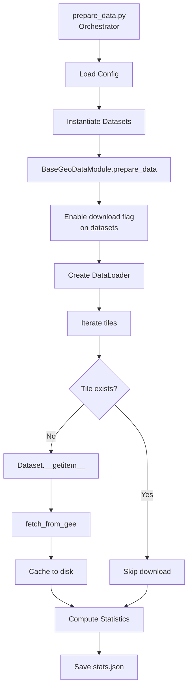

# Data Preparation Guide

`scripts/prepare_data.py` is a utility script to facilitate data preparation for training and inference pipelines. Specifically, the script fetches data for all `GEERasterDatasets` called by a datamodule and computes normalization statistics for all input datasets.

---

## 1. Overview

The `prepare_data.py` script is a one-time setup tool that:

1. **Downloads** satellite imagery and target data from Google Earth Engine
2. **Computes** per-channel normalization statistics (mean, std, min, max)
3. **Saves** statistics to a JSON file for reuse during training

### When to Run

| Scenario | Action |
|----------|--------|
| First time training on a dataset | Run `prepare_data.py` first |
| Adding new tiles to training set | Re-run with `--overwrite` |
| Changing band selection in config | Re-run to update stats |
| Preparing inference data only | Use `--predict-only` mode |
| Training on existing prepared data | Skip (stats file exists) |

---

## 2. How it works

The script uses a **delegation pattern** where `prepare_data.py` orchestrates the workflow but delegates actual download logic to the DataModule and Dataset layers.



### Key Components

| Component | Responsibility |
|-----------|---------------|
| `prepare_data.py` | CLI interface, config parsing, orchestration |
| `BaseGeoDataModule` | Manages dataset tree, enables download mode |
| `Dataset` (GEESentinel2, etc.) | Lazy download in `__getitem__` when flag is set |
| `DatasetStats` | Computes mean/std across all tiles |
| `TileGeoSampler` | Provides geographic tile iteration |


### Steps Performed

1. **Load Configuration**: Parse YAML config file
2. **Load Tile Geometries**: Read GeoJSON for train/val/test/predict tiles
3. **Instantiate Datasets**: Create dataset instances with transforms (excluding Normalize)
4. **Download Data**: Iterate through tiles, downloading missing data from GEE
5. **Compute Statistics**: Calculate mean, std, min, max per channel
6. **Apply Identity Channels**: Force mean=0, std=1 for specified channels
7. **Save Statistics**: Write JSON file with input_stats and target_stats

---

## 3. Prerequisites

### Google Earth Engine Authentication

Before running the script, ensure you are authenticated with GEE:

```bash
# Set environment variables
export GEE_PROJECT_NAME="your-project-id"
export GOOGLE_APPLICATION_CREDENTIALS="/path/to/service-account-key.json"

# Or use .env file
cp .env.example .env
# Edit .env with your credentials
```

### Configuration File Structure

The script expects a YAML config file with a `data.init_args` section:

```yaml
data:
  class_path: forestvision.datamodules.GNNDataModule
  init_args:
    root: data/fortypba
    year: 2021
    stats_path: train_stats_2021.json
    train_tiles_path: tiles/train.geojson
    val_tiles_path: tiles/val.geojson
    
    input_datasets:
      - dataset_class: forestvision.datasets.GEESentinel2
        path_template: "training/sentinel/{year}"
        bands: ["B2", "B3", "B4", "B8"]
    
    target_datasets:
      - dataset_class: forestvision.datasets.GNNForestAttr
        path_template: "training/gnn/{year}"
        bands: ["fortypba"]
```

### Required Config Fields

| Field | Description |
|-------|-------------|
| `root` | Base data directory |
| `year` | Acquisition year for temporal data |
| `stats_path` | Where to save statistics file (relative to root) |
| `train_tiles_path` | GeoJSON with training tile boundaries |
| `input_datasets` | List of input dataset configurations |
| `target_datasets` | List of target dataset configurations |

### Path Template Placeholders

Path templates support these placeholders:

| Placeholder | Description | Example |
|-------------|-------------|---------|
| `{root}` | Base directory | `data/fortypba` |
| `{year}` | Year from config | `2021` |
| `{stage}` | Current stage | `training`, `validation`, `test` |
| `{shape}` | Patch size as shape string | `128x128`, `256x256`, `512x512` |

The `{shape}` placeholder is derived from the `patch_size` parameter. For example, `patch_size: 256` becomes `256x256` in the path template. This allows organizing data by tile dimensions.

---

## 4. Usage

### 4.1 Basic Usage (Training Mode)

Prepare data for training by downloading and computing statistics for both inputs and targets:

```bash
python scripts/prepare_data.py --config configs/experiment.yaml
```

Compute only image statistics (skip target/mask stats):

```bash
python scripts/prepare_data.py --config configs/experiment.yaml --on-keys image
```

Compute only mask statistics:

```bash
python scripts/prepare_data.py --config configs/experiment.yaml --on-keys mask
```

### 4.2 Prediction-Only Mode

Download data for inference without computing statistics:

```bash
python scripts/prepare_data.py --config configs/experiment.yaml --predict-only
```

With custom prediction tiles and year:

```bash
python scripts/prepare_data.py --config configs/experiment.yaml \
    --predict-only \
    --predict-tiles-path data/inference/tiles_2023.geojson \
    --predict-year 2023
```

### 4.3 Advanced Options

#### Skip Download

Use this when data is already downloaded and you only need to recompute statistics:

```bash
python scripts/prepare_data.py --config configs/experiment.yaml --skip-download
```

#### Overwrite Existing Stats

Recompute statistics even if stats file exists:

```bash
python scripts/prepare_data.py --config configs/experiment.yaml --overwrite
```

#### Download All Available Bands

Download all bands from GEE (not just those in config), useful for experimentation:

```bash
python scripts/prepare_data.py --config configs/experiment.yaml --download-all-bands
```

#### Per-Dataset Identity Channels

Set specific channels to have identity normalization (mean=0, std=1) per dataset:

```bash
# Format: "dataset1_ch1 ch2; dataset2_ch1; dataset3_ch1 ch2"
python scripts/prepare_data.py --config configs/experiment.yaml \
    --input-identity-channels "10 11; 0; 1 2 3" \
    --target-identity-channels "0"
```

Example with 3 input datasets:
- Dataset 1 (GEESentinel2): channels 10, 11 get identity stats (e.g., NDVI, NDWI)
- Dataset 2 (GEE3Dep): channel 0 gets identity stats
- Dataset 3 (ClimateNA): channels 1, 2, 3 get identity stats

---

## 5. Configuration Reference

### Dataset Configuration

Each dataset in `input_datasets` or `target_datasets` requires:

```yaml
- dataset_class: forestvision.datasets.GEESentinel2
  path_template: "training/sentinel/{year}"
  bands: ["B2", "B3", "B4", "B8"]
  kwargs:
    season: "leafon"
    res: 10
  transforms:
    class_path: torchvision.transforms.v2.Compose
    init_args:
      transforms:
        - class_path: forestvision.transforms.AppendNDVI
          init_args:
            index_nir: 6
            index_red: 2
```

### Transforms During Preparation

During data preparation:

- **Included**: `SelectBands`, `AppendNDVI`, `AppendSAVI`, `CombineGNNDWMask`
- **Excluded**: `Normalize` (stats are being computed, not applied)

This ensures statistics reflect the actual channels the model will see after transforms.

---

## 6. Output Format

The script saves statistics to a JSON file with the following structure:

```json
{
  "input_stats": [
    {
      "dataset_class": "GEESentinel2",
      "config_index": 0,
      "mean": [483.08, 690.95, 682.36, ...],
      "std": [505.17, 517.87, 648.91, ...],
      "min": [0.0, 0.0, 0.0, ...],
      "max": [10000.0, 10000.0, 10000.0, ...],
      "nodata_info": {
        "value": -2147483648,
        "pixels": 12345
      }
    },
    {
      "dataset_class": "GEE3Dep",
      "config_index": 1,
      "mean": [906.12],
      "std": [624.03],
      ...
    }
  ],
  "target_stats": {
    "mean": [0.0, 4116.01],
    "std": [1.0, 3492.37],
    "min": [-1.0, 0.0],
    "max": [13.0, 10000.0]
  },
  "year": 2021
}
```

### Input Stats Format

Input stats use a **list-based structure** (not dict) to support multiple datasets with the same class name:

| Field | Description |
|-------|-------------|
| `dataset_class` | Class name for reference |
| `config_index` | Position in config list (prevents collision) |
| `mean` | Per-channel mean values |
| `std` | Per-channel standard deviation |
| `min` | Per-channel minimum values |
| `max` | Per-channel maximum values |
| `nodata_info` | NoData value and pixel count (if applicable) |

### Target Stats Format

Target stats are stored as a single object (combined across all target datasets) with the same fields as input stats.

### NoData Handling

NoData values are excluded from statistics computation. Common NoData values:

| Dataset | NoData Value |
|---------|--------------|
| GNNForestAttr | -2147483648 (int32 min) |
| GEEDynamicWorld | 0 |
| Sentinel-2 | 0 |

---

## 7. Integration with Training

### Training Workflow

After running `prepare_data.py`, training becomes faster:

```bash
# Step 1: Prepare data (run once)
python scripts/prepare_data.py --config configs/experiment.yaml

# Step 2: Train (run many times, 3-5x faster)
torchgeo fit --config configs/experiment.yaml
```

### How Training Uses the Stats File

When `torchgeo fit` runs:

1. DataModule checks if stats file exists
2. If yes, **automatically disables GEE downloads**
3. Loads statistics from JSON file
4. Populates `Normalize` transforms with pre-computed mean/std
5. Training starts in 5-15 seconds instead of 30-60 seconds

### Resume Training

For resume training, statistics are loaded from the checkpoint, not the JSON file:

```bash
torchgeo fit --config configs/experiment.yaml --ckpt_path checkpoints/last.ckpt
```

The checkpoint stores stats in `hparams`, so the JSON file is not needed after the first training run.

---

## 8. Troubleshooting

### Issue: "Statistics file already exists"

**Solution**: Use `--overwrite` to recompute, or skip if data hasn't changed.

### Issue: "Dataset not found"

**Cause**: Data hasn't been downloaded yet and `--skip-download` was used.

**Solution**: Remove `--skip-download` to download data first.

### Issue: Slow GEE downloads

**Causes**:
- Large tile sets
- High GEE API latency
- Network issues

**Solutions**:
- Reduce number of tiles for initial testing
- Check GEE quota: `ee.data.getAssetRoots()`
- Use smaller batch sizes: Edit `batch_size` in script (default: 15)

### Issue: Shape mismatch during training

**Cause**: Stats file doesn't match current config (bands changed, transforms added).

**Solution**: Re-run with `--overwrite` to recompute statistics.

### Issue: Validation/Test data not downloaded

**Cause**: Validation tiles use same directory as training (spatial split).

**Solution**: This is expected. Spatial splits share directories; splits are defined by tile GeoJSON files, not directory structure.

### Verify Setup

To verify the stats file was created correctly:

```python
import json
with open('data/fortypba/train_stats_2021.json') as f:
    stats = json.load(f)
print(f"Input datasets: {len(stats['input_stats'])}")
print(f"Target channels: {len(stats['target_stats']['mean'])}")
```

---

## 9. CLI Reference

### Arguments

| Argument | Short | Default | Description |
|----------|-------|---------|-------------|
| `--config` | | Required | Path to YAML config file |
| `--on-keys` | | `image mask` | Which sample types to compute stats for |
| `--skip-download` | | False | Skip data download (assume data exists) |
| `--overwrite` | | False | Overwrite existing statistics file |
| `--download-all-bands` | | False | Download all available bands from GEE |
| `--input-identity-channels` | `-iic` | None | Per-dataset identity channels for inputs |
| `--target-identity-channels` | `-tic` | None | Per-dataset identity channels for targets |
| `--predict-only` | | False | Download prediction data only (no stats) |
| `--predict-tiles-path` | | None | Path to prediction tiles GeoJSON |
| `--predict-year` | | None | Year for prediction data |
| `--patch-size` | | None | Patch size for path template (e.g., 128, 256, 512) |

### Examples Summary

```bash
# Standard training preparation
python scripts/prepare_data.py --config configs/experiment.yaml

# Prediction-only mode
python scripts/prepare_data.py --config configs/experiment.yaml --predict-only

# Recompute stats without re-downloading
python scripts/prepare_data.py --config configs/experiment.yaml --skip-download --overwrite

# Download all bands for experimentation
python scripts/prepare_data.py --config configs/experiment.yaml --download-all-bands

# Set identity channels for NDVI/indices
python scripts/prepare_data.py --config configs/experiment.yaml \
    --input-identity-channels "10 11" \
    --target-identity-channels "0"

# Prediction with different tile size (e.g., 512x512)
python scripts/prepare_data.py --config configs/experiment.yaml \
    --predict-only \
    --predict-tiles-path tiles/predict_large.geojson \
    --patch-size 512
```

---

## 10. Working with Different Tile Sizes

### Using `{shape}` Placeholder for Organizing Data

The `{shape}` placeholder in path templates allows organizing data by tile dimensions. This is useful when:

- Training on smaller tiles (e.g., 128x128)
- Running inference on larger tiles (e.g., 512x512)
- Comparing model performance across different tile sizes

### Config Example with `{shape}`

```yaml
data:
  class_path: forestvision.datamodules.BaseGeoDataModule
  init_args:
    root: data/fortypba
    year: 2021
    patch_size: 256  # Used for model input AND path template
    
    input_datasets:
      - dataset_class: forestvision.datasets.GEESentinel2
        path_template: "training/sentinel/{year}/{shape}"
        bands: ["B2", "B3", "B4", "B8"]
```

With this config:
- Training data: `data/fortypba/training/sentinel/2021/256x256/`
- If `--patch-size 512` is used: `data/fortypba/training/sentinel/2021/512x512/`

### Integration with TorchGeo CLI

The `{shape}` placeholder works seamlessly with torchgeo CLI. The DataModule uses the same `patch_size` parameter:

```bash
# Config has patch_size: 256
# Data is loaded from: {shape} -> 256x256
torchgeo fit --config configs/experiment.yaml

# To use a different patch_size, update the config or use CLI override
torchgeo fit --config configs/experiment.yaml --data.patch_size=512
```


*Last updated: 2026-03-09*
