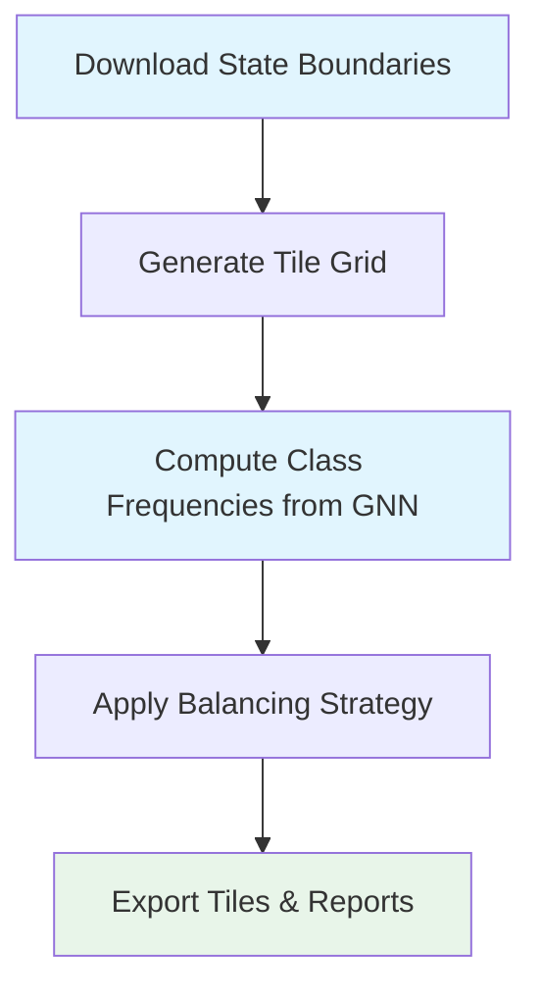
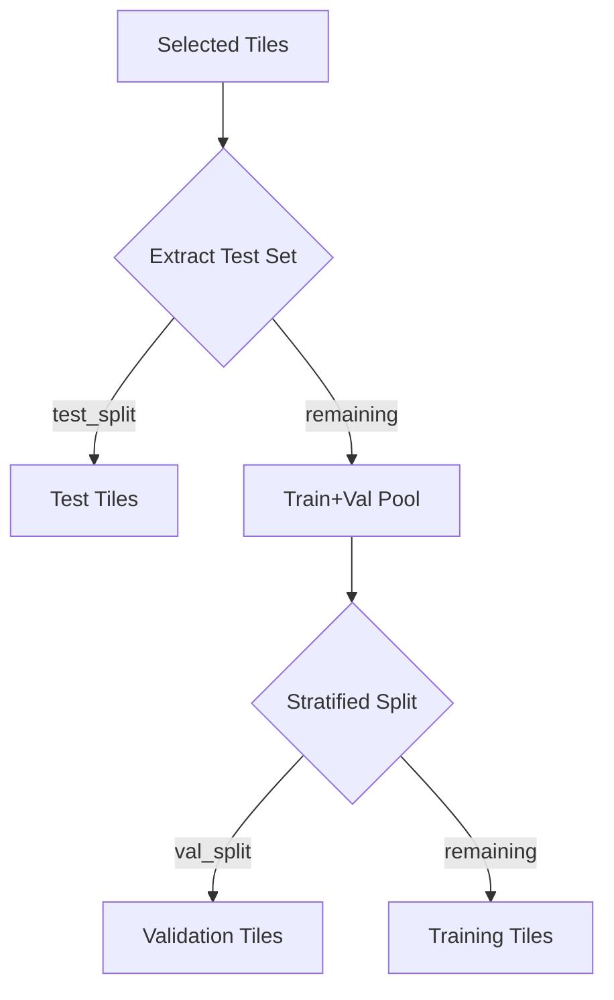
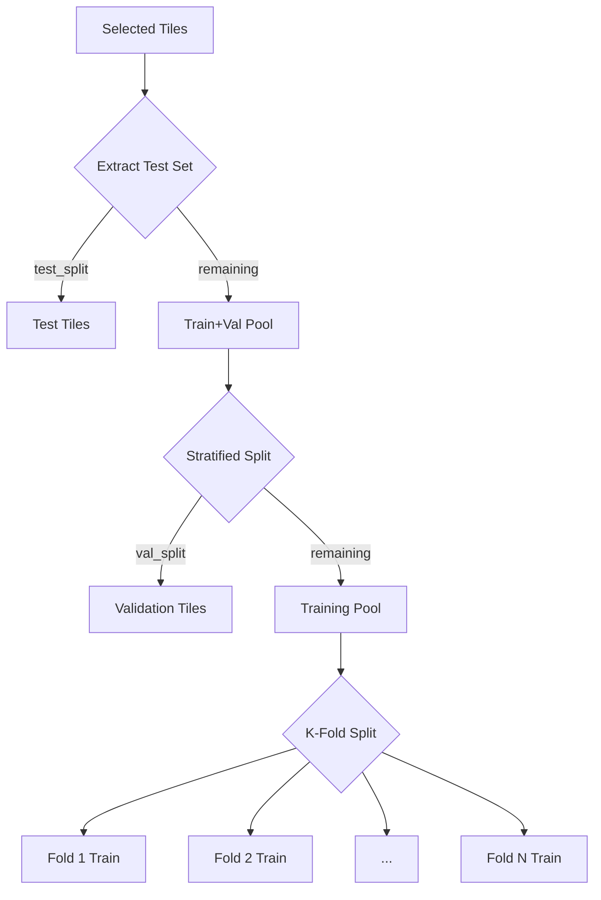

# Sample Tiles Script Documentation

## Overview

`scripts/sample_tiles.py` generates balanced sets of geographic tiles for forest type classification model training and validation. It analyzes class distributions from GNN (Gradient Nearest Neighbor) data and selects a representative subset of tiles based on configurable balancing strategies.

This script is the first step in the ForestVision data pipeline, preceding data download and model training.

## Workflow



## Detailed Process

### 1. Load or Generate Tiles

The script supports two tile input modes:

**Generate from State Boundaries** (default):
- Downloads US Census state boundary shapefiles (Oregon & Washington)
- Reprojects to EPSG:5070 (Albers Equal Area)
- Generates non-overlapping grid using `roi_to_tiles()`
- Filters tiles to state boundaries
- Saves to `tiles_{SIZE}x{SIZE}/all_{SIZE}x{SIZE}_{RES}m.geojson`

**Use Existing Tiles** (`--input-tiles`):
- Loads user-provided GeoJSON tile file
- Useful for custom regions or pre-defined boundaries

### 2. Compute Class Frequencies

For each tile overlapping the GNN dataset:


**Nodata Filtering**:
- Tiles with more than `--max-nodata` (default 30%) invalid pixels are excluded
- Invalid pixels: GNN nodata values (-2147483648) or remapped nodata (-1)
- Tracks nodata statistics for reporting

**Output**: `tiles_{SIZE}x{SIZE}/all_{SIZE}x{SIZE}_{RES}m_frequencies.csv`

### 3. Select Balanced Subset

Groups tiles by dominant ODF class and applies selected balancing strategy.

### 4. Split and Export

Supports two splitting modes:

**Single Split Mode** (default):
- Stratified train/val/test split
- Configurable split ratios (default: 70% train, 15% val, 15% test)

**K-Fold Mode** (`--k-folds N`):
- First extracts hold-out test set
- Creates N stratified folds from remaining data
- Generates fold-specific training sets

## Configuration

### SamplerConfig Parameters

| Parameter | Type | Default | Description |
|-----------|------|---------|-------------|
| `output_path` | Path | Required | Directory for output tiles subdirectory |
| `name` | str | None | Custom base name for output files |
| `gnn_path` | str | "data/datasets/gnn" | Path to GNN dataset for frequency analysis |
| `states` | list | ["Oregon", "Washington"] | States to include in tile generation |
| `tile_size` | int | 128 | Tile size in pixels |
| `tile_res` | int | 10 | Spatial resolution in meters |
| `sample_size` | int | 8000 | Target number of tiles to select |
| `random_state` | int | 42 | Random seed for reproducibility |
| `batch_size` | int | 64 | Batch size for GNN sampling |
| `num_workers` | int | 10 | Parallel workers for data loading |
| `k_folds` | int | None | Number of folds for cross-validation |
| `val_split` | float | 0.15 | Validation split proportion |
| `test_split` | float | 0.15 | Test split proportion |
| `balance_strategy` | str | "none" | Balancing strategy (see below) |
| `min_samples` | int | 10 | Minimum samples per class |
| `inference` | bool | False | Inference mode (no frequency computation) |
| `max_nodata` | float | 0.3 | Maximum nodata fraction per tile |

### Command-Line Arguments

All SamplerConfig parameters are exposed as CLI arguments with sensible defaults.

## Balancing Strategies

| Strategy | Description | Best For |
|----------|-------------|----------|
| `none` | Simple random sampling without balancing | Quick testing, large datasets |
| `equal` | Equal number of tiles for every dominant class | Maximum class balance |
| `proportional` | Natural distribution with sample size cap | Preserving natural ratios |
| `inverse_freq` | Boost rare classes using inverse frequency weights | Handling class imbalance |
| `capped` | Pixel-level balancing ensuring class sufficiency | Ensuring all classes represented |

## Usage Examples

### Basic Usage

```bash
# Generate 128x128 tiles (default)
python scripts/sample_tiles.py --output-path data/fortypba/ --sample-size 8000

# Generate 256x256 tiles
python scripts/sample_tiles.py --output-path data/fortypba/ --tile-size 256 --sample-size 8000
```

### K-Fold Cross-Validation

```bash
python scripts/sample_tiles.py --output-path data/fortypba/ --tile-size 256 --k-folds 5
```

### Balanced Sampling

```bash
# Proportional balancing
python scripts/sample_tiles.py \
    --output-path data/dev/ \
    --sample-size 10000 \
    --sampling-strategy proportional \
    --batch-size 64 \
    --num-workers 19
```

### Dry Run (Testing)

```bash
python scripts/sample_tiles.py --output-path data/fortypba/ --tile-size 256 --dry-run
```

### Inference Mode

```bash
python scripts/sample_tiles.py \
    --output-path data/inference/ \
    --inference \
    --input-tiles data/inference/custom_region.geojson
```

## Output Files

### Directory Structure

```
{output_path}/tiles_{SIZE}x{SIZE}/
├── {base}_all.geojson                 # All generated tiles
├── {base}_frequencies.csv             # Class frequency per tile
├── {prefix}_{SIZE}x{SIZE}_{RES}m_train.geojson    # Training tiles
├── {prefix}_{SIZE}x{SIZE}_{RES}m_val.geojson      # Validation tiles
├── {prefix}_{SIZE}x{SIZE}_{RES}m_test.geojson     # Test tiles
├── {prefix}_{SIZE}x{SIZE}_{RES}m_train.csv        # Training frequencies
├── {prefix}_{SIZE}x{SIZE}_{RES}m_val.csv          # Validation frequencies
├── {prefix}_{SIZE}x{SIZE}_{RES}m_test.csv         # Test frequencies
├── {prefix}_{SIZE}x{SIZE}_{RES}m_weights.csv      # Class weights for loss
└── {prefix}_{SIZE}x{SIZE}_{RES}m_report.md        # Markdown report
```

### K-Fold Additional Outputs

```
{prefix}_{SIZE}x{SIZE}_{RES}m_fold_1_train.geojson
{prefix}_{SIZE}x{SIZE}_{RES}m_fold_2_train.geojson
...
{prefix}_{SIZE}x{SIZE}_{RES}m_fold_N_train.geojson
```

### File Descriptions

| File | Description |
|------|-------------|
| `*_all.geojson` | Complete tile grid with geohash IDs |
| `*_frequencies.csv` | Per-tile class counts and frequencies |
| `*_{split}.geojson` | Split-specific tile boundaries |
| `*_{split}.csv` | Split-specific frequency data |
| `*_weights.csv` | Inverse frequency class weights for loss functions |
| `*_report.md` | Comprehensive sampling summary and statistics |

## Splitting Modes

### Single Split (Default)



Stratification bins by:
1. Dominant ODF class
2. Number of unique classes per tile (binned: 1-2, 3-4, 5-6, 7-8, 9+)

### K-Fold Cross-Validation



Test and validation sets are shared across all folds. Each fold has a distinct training set.

## Integration with Pipeline

`sample_tiles.py` is the first step in the ForestVision pipeline:


1. **Generate tiles** with `sample_tiles.py`
2. **Download data** with `prepare_data.py` using tile GeoJSONs
3. **Train models** referencing the same tile files

## Notes

- Tile generation uses EPSG:5070 (Albers Equal Area) for accurate area calculations
- Geohash IDs are MD5 hashes of bounding box coordinates (first 10 chars)
- Stratification ensures geographic and class diversity in splits
- Class weights are computed as inverse frequency normalized by number of classes
- Inference mode skips frequency computation and exports all tiles intersecting GNN ROI

## See Also

- [`DATA_PIPELINE.md`](DATA_PIPELINE.md) - Full data pipeline documentation
- [`PREPARE_DATA.md`](PREPARE_DATA.md) - Data preparation guide
- [`ARCHITECTURE.md`](ARCHITECTURE.md) - System architecture overview
